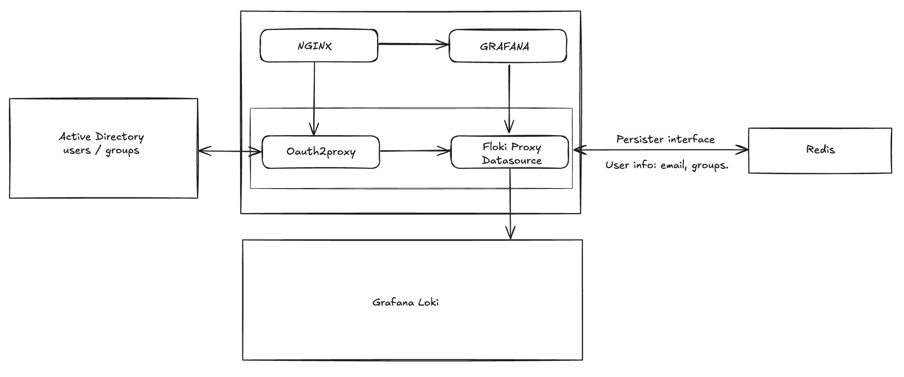

<!-- Improved compatibility of back to top link: See: https://github.com/othneildrew/Best-README-Template/pull/73 -->
<a name="readme-top"></a>
<!--
*** Thanks for checking out the Best-README-Template. If you have a suggestion
*** that would make this better, please fork the repo and create a pull request
*** or simply open an issue with the tag "enhancement".
*** Don't forget to give the project a star!
*** Thanks again! Now go create something AMAZING! :D
-->


<!-- PROJECT SHIELDS -->
<!--
*** I'm using markdown "reference style" links for readability.
*** Reference links are enclosed in brackets [ ] instead of parentheses ( ).
*** See the bottom of this document for the declaration of the reference variables
*** for contributors-url, forks-url, etc. This is an optional, concise syntax you may use.
*** https://www.markdownguide.org/basic-syntax/#reference-style-links
-->
<!-- [![Contributors][contributors-shield]][contributors-url]
[![Forks][forks-shield]][forks-url] -->
<!-- [![Stargazers][stars-shield]][stars-url] -->
[![Issues][issues-shield]][issues-url]
[![MIT License][license-shield]][license-url]
[![LinkedIn][linkedin-shield]][linkedin-url]

<!-- PROJECT LOGO -->
<br />
<div align="center">

  <h3 align="center">Floki (Fake-Loki)</h3>

  <p align="center">
    Floki http reverse proxy.
  <br />

  </p>
</div>

<!-- TABLE OF CONTENTS -->
<details>
  <summary>Table of Contents</summary>
  <ol>
    <li>
      <a href="#about-the-project">About The Project</a>
      <ul>
        <li><a href="#built-with">Built With</a></li>
      </ul>
    </li>
    <li>
      <a href="#getting-started">Getting Started</a>
      <ul>
        <li><a href="#prerequisites">Prerequisites</a></li>
        <li><a href="#installation">Installation</a></li>
      </ul>
    </li>
    <li><a href="#usage">Usage</a></li>
    <li><a href="#roadmap">Roadmap</a></li>
    <li><a href="#contributing">Contributing</a></li>
    <li><a href="#license">License</a></li>
    <li><a href="#contact">Contact</a></li>
    <li><a href="#acknowledgments">Acknowledgments</a></li>
  </ol>
</details>


<!-- ABOUT THE PROJECT -->
## About The Project

<!-- [![Product Name Screen Shot][product-screenshot]](https://example.com) -->

Floki (Fake Loki)
Floki is an application written in Golang that serves as a reverse HTTP proxy. Designed to be used as a middleware application, Floki works in conjunction with OAuth2 Proxy to create a tenant management system for Grafana Loki.

## Key Features
* Reverse HTTP Proxy: Efficiently handles and forwards HTTP requests to appropriate back-end services.
* Middleware Integration: Seamlessly integrates with OAuth2 Proxy to enhance security and manage user authentication.
* Tenant Management: Facilitates the organization and management of multiple tenants within Grafana Loki.
* Written in Golang: Leverages the performance and concurrency features of Go for robust and scalable operations.
## Purpose
Floki simplifies the process of managing and authenticating multiple tenants in Grafana Loki, providing a streamlined and secure solution for handling HTTP requests and user authentication.



<p align="right">(<a href="#readme-top">back to top</a>)</p>

### Built With

[![Golang][Golang.dev]][golang-url]

<p align="right">(<a href="#readme-top">back to top</a>)</p>

## Getting Started
This project is meant to be used as a golang package and imported into Oauth2 proxy.

```golang
import "github.com/rodolfo-mora/floki"
```


<p align="right">(<a href="#readme-top">back to top</a>)</p>

<!-- USAGE EXAMPLES -->
## Usage
Application configuration is donde by providing specific environment variables listed below.

* FLOKI_LOKI_URL: This is usually the load balancer URL that has access to Loki read nodes (default: http://localhost:3100).
* FLOKI_PROXY_PORT: Port used for Floki reverse proxy that will act as Grafana Loki datasource (default: ":8080").
* FLOKI_EXPORTER_PORT: Port used by the proxy Prometheus exporter (default: ":3100")
* FLOKI_TENANTFILE_PATH: Path to YAML tenant that houses AD groups and tenant relationships (default: /opt/floki/tenants.yaml).
* FLOKI_TRACKFILE_PATH: Trackfile is used by the TenantManager and its purpose is to help detect changes in tenant configuration YAML file (default: /opt/floki/track).

<p align="right">(<a href="#readme-top">back to top</a>)</p>
<p align="right">(<a href="#readme-top">back to top</a>)</p>

## License
Distributed under the MIT License. See `LICENSE.txt` for more information.

<p align="right">(<a href="#readme-top">back to top</a>)</p>

## Contact

Rodolfo Mora Gonzalez - rodolfo.mora.gonzalez@gmail.com

Project Link: [https://github.com/your_username/repo_name](https://github.com/your_username/repo_name)

<p align="right">(<a href="#readme-top">back to top</a>)</p>

<!-- MARKDOWN LINKS & IMAGES -->
<!-- https://www.markdownguide.org/basic-syntax/#reference-style-links -->

[stars-shield]: https://img.shields.io/github/stars/othneildrew/Best-README-Template.svg?style=for-the-badge
[stars-url]: https://github.com/rodolfo-mora/golang-log-generator/stargazers
[issues-shield]: https://img.shields.io/github/issues/othneildrew/Best-README-Template.svg?style=for-the-badge
[issues-url]: https://github.com/rodolfo-mora/golang-log-generator/issues
[license-shield]: https://img.shields.io/github/license/othneildrew/Best-README-Template.svg?style=for-the-badge
[license-url]: https://github.com/othneildrew/Best-README-Template/blob/master/LICENSE.txt
[linkedin-shield]: https://img.shields.io/badge/-LinkedIn-black.svg?style=for-the-badge&logo=linkedin&colorB=555
[linkedin-url]: https://www.linkedin.com/in/rodolfo-mora-2214a9b7
[golang-url]: https://go.dev/
[Golang.dev]: https://img.shields.io/badge/Go-00ADD8?style=for-the-badge&logo=go&logoColor=white